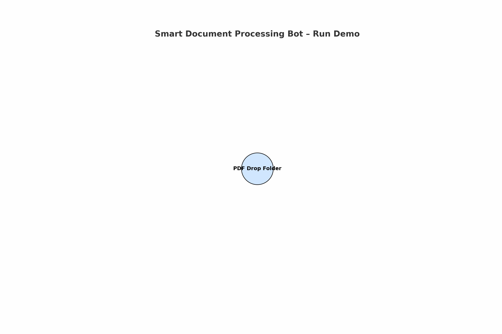

# Smart Document Processing Bot

> **TL;DR**: This project automates document processing using UiPath, OCR, and AI.  
> It extracts text from scanned PDFs, summarizes it with a custom API, and outputs structured results.

### Non-technical Summary:

Imagine someone drops a stack of medical or financial documents on your desk and asks you to pull out the key details — names, dates, amounts, and a short summary — and then email a clean report. This bot does exactly that, automatically. It watches a folder for new PDFs, reads them like a human using OCR, sends the text to a small AI engine that pulls out the most important info, saves everything to a spreadsheet, and emails the results. No manual work, no errors — just fast, smart automation.

An end-to-end automation solution that combines UiPath with AI to extract, summarize, and process scanned documents. Designed for business workflows that require intelligent document understanding and structured output.

Explore the code, run the demo, or use this template to build your own AI-powered automation. This repo is designed to be understandable, adaptable, and production-ready.

---

## Features

- Reads scanned PDFs from a designated folder
- Extracts text using OCR (Tesseract or UiPath Document OCR)
- Sends extracted text to a Python-based AI API
- Performs summarization and key field extraction (e.g., name, date, amount)
- Saves structured data to Excel
- Sends a summary report via email

---

## Architecture



This project integrates UiPath with a custom FastAPI backend to process documents intelligently. UiPath handles orchestration, file handling, and notifications. FastAPI handles NLP and data extraction.

---

## Tech Stack

- **UiPath Studio** (with REFramework)
- **Python 3.10+** (FastAPI)
- **OCR:** Tesseract / UiPath Document OCR
- **Excel Automation**
- **SMTP Email**
- **GitHub for version control**

---

## Setup & Run Instructions

### 1. Start the AI API

```bash
cd ai_api
pip install -r requirements.txt
uvicorn main:app --reload
```

### File Directory

```
Smart-Document-Bot/
│
├── README.md
├── LICENSE
├── architecture-diagram.png
├── run-demo.gif
│
├── UiPathProject/
│   ├── Main.xaml
│   ├── ProcessDocument.xaml
│   ├── Config.xlsx
│   ├── project.json
│   ├── Screenshots/
│   └── Documentation.pdf
│
├── ai_api/
│   ├── main.py
│   ├── requirements.txt
│   ├── model/
│   │   └── summarizer.py
│   ├── utils/
│   │   └── parser.py
│   └── test_data/
│       └── sample_text.txt
│
├── sample_documents/
│   └── invoice1.pdf
│
├── output/
│   └── processed_data.xlsx
│
└── logs/
    └── run_log_2025-04-04.txt
    
```
